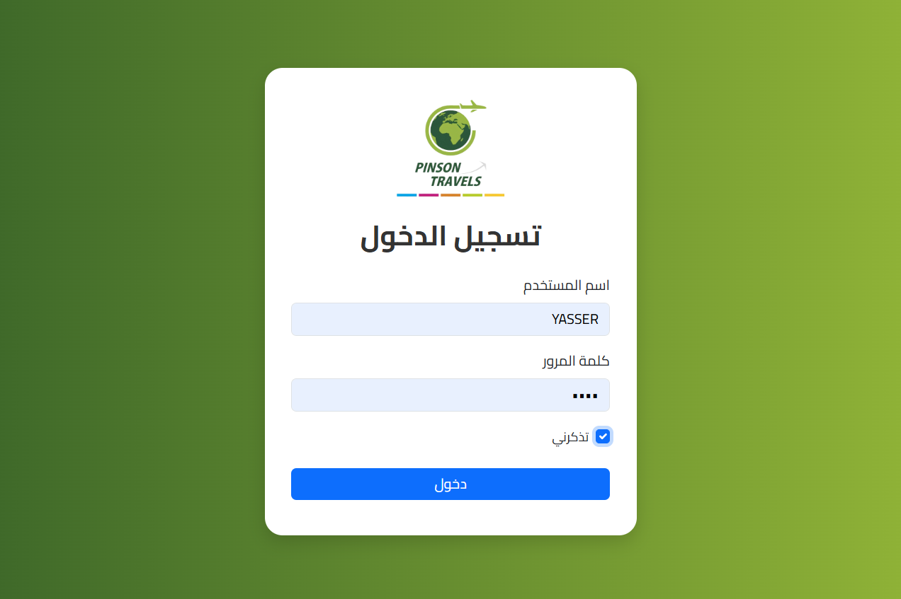
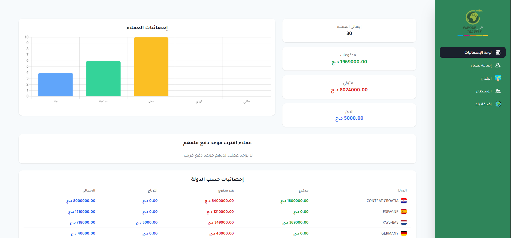
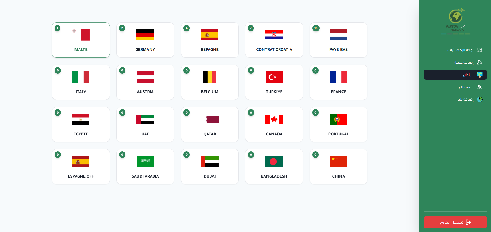
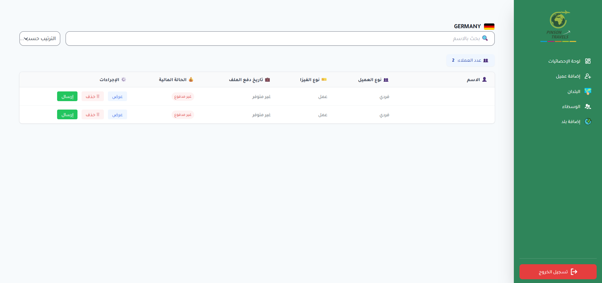
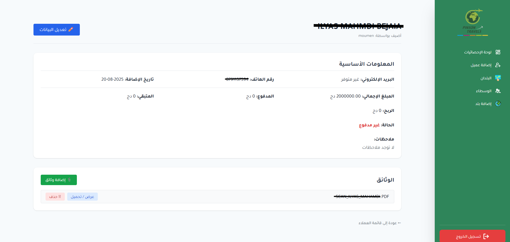

# 🌍 Flask Agents Management App

A web application built with **Flask** to manage clients, agents, countries, and documents.  
The system makes it easy to register clients, upload their files, assign them to agents, and send details via email with attachments.

---

## ✨ Features
- Manage **countries** with flags.
- Manage **agents** (name, email, country).
- Manage **clients** (personal info + uploaded files).
- Upload and store files per client in the `uploads/` directory.
- Send client details and files directly to an agent via **Gmail**.
- User authentication with dashboard view.
- Organized structure with `Flask` blueprints.

---

## 🛠️ Tech Stack
- **Backend:** Flask (Python)
- **Database:** SQL (via `backup.sql`)
- **Frontend:** Jinja2 templates, Bootstrap, custom icons & logos
- **Email:** Gmail SMTP
- **Deployment:** Cross-platform (Windows/Linux)

---

## 📂 Project Structure
```text
.
├── run_app.py          # Main entry point
├── server.py           # Flask app instance
├── requirements.txt    # Dependencies
├── config.example.env  # Example environment config
├── backup.sql          # Database schema / backup
├── static/             # Static files (icons, fonts, logo)
├── templates/          # HTML templates
├── uploads/            # Uploaded client files (ignored by Git)
├── flask_session/      # Flask sessions (ignored by Git)
├── .gitignore
├── LICENSE
└── README.md
```
## ⚙️ Installation
Clone the repository
```text
git clone https://github.com/your-username/flask-agents-management.git
cd flask-agents-management
```
Create and activate a virtual environment
```text
ython -m venv venv
source venv/bin/activate   # On Linux/Mac
venv\Scripts\activate      # On Windows
```
Install dependencies
```text
pip install -r requirements.txt
```

Set up environment variables
Create a .env file (use config.example.env as a template):
```text
FLASK_APP=run_app.py
FLASK_ENV=development
SECRET_KEY=your-secret-key
MAIL_USERNAME=your-email@gmail.com
MAIL_PASSWORD=your-app-password
```

Initialize the database
```text
sqlite3 database.db < backup.sql
```

Run the app
```text
python run_app.py```
```

## 🚀 Usage

Log in with your credentials.

Add countries (with flags).

Register agents and assign them to countries.

Register clients and upload documents.

Send client data & files to assigned agents via email.

## 📸 Screenshots

### Login Page


### Dashboard


### Others





## 📜 License

This project is licensed under the MIT License – see the LICENSE
 file for details.

## 🤝 Contributing

Pull requests are welcome!
For major changes, please open an issue first to discuss what you would like to change.

## 👨‍💻 Author

Developed by Yasser Debihi
Feel free to reach out for suggestions or collaboration.


